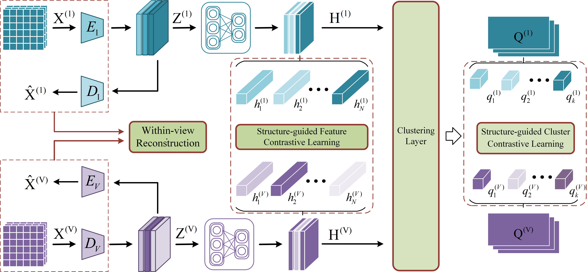

# SGFCC
[Structure-guided Feature and Cluster Contrastive Learning for Multi-View Clustering](https://doi.org/10.1016/j.neucom.2024.127555)
> **Authors:**
Zhenqiu Shu, Bin Li, Cunli Mao, Shengxiang Gao, Zhengtao Yu

## Methodology
The framework of our proposed SGFCC, which utilizes autoencoders to achieve view-specific information reconstruction in feature space, and extracts high-level features for multi-view consistent representation learning to eliminate the effects of view-specific information and noise on consistent representation. To fully capture the similar clustering structure of high-level features and semantic features of samples across different views, we adopt a structure-guided feature-level and cluster-level contrastive learning strategy in our SGFCC model. Furthermore, we design a clustering layer to explore the cluster structure of high-level features. Different from most existing MVC methods, SGFCC applies a non-fusion scheme that aggregates the semantic information of all views to obtain the final semantic labels. Extensive experiments on public datasets demonstrate that our method outperforms other competitors in clustering tasks.  

## Datasets
The multi-view datasets are located in the "data" folder. For dataset that need to be processed, using the tools packaged in "dataloader.py".

## Requirements
numpy==1.23.4  
torchvision==0.14.0  
torch>=1.13.0  
python==3.8.15

## Usage
The network structure is defined in "network.py".  
To train the model with multi-view datasets, run: python "train.py".  
To test the trained model, run: python "test.py".  

## Citation
>  @article{shu2024structure,  
>    title={Structure-guided feature and cluster contrastive learning for multi-view clustering},  
>    author={Shu, Zhenqiu and Li, Bin and Mao, Cunli and Gao, Shengxiang and Yu, Zhengtao},   
>    journal={Neurocomputing},   
>    pages={127555},  
>    year={2024},  
>    publisher={Elsevier}  
> }  

If you have any problems, contact me via [libinishere@gmail.com]().
